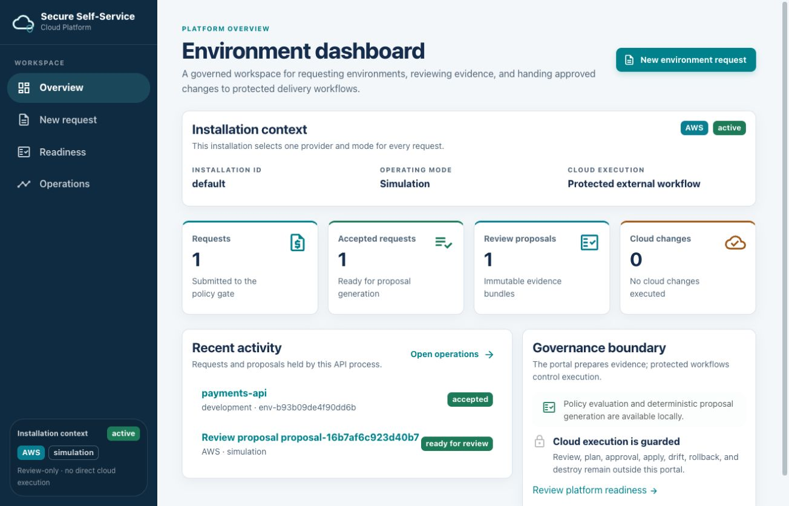

# Secure Self-Service Cloud Platform

[](https://github.com/abdalrahmanattya/secure-self-service-cloud-platform/actions/workflows/quality.yml)
[](https://github.com/abdalrahmanattya/secure-self-service-cloud-platform/actions/workflows/pages.yml)
[](https://github.com/abdalrahmanattya/secure-self-service-cloud-platform/releases/latest)
[](LICENSE)

A portfolio-grade internal developer platform for requesting secure,
policy-compliant Kubernetes environments on either Amazon Web Services (AWS)
or Microsoft Azure.

An administrator selects one provider and one operating mode. Developers then
use a friendly portal, REST API, or CLI to submit requests. The platform
normalizes each request, evaluates policy, describes the expected provider
resources, and creates a deterministic proposal for review.

> **Status:** `v1.0.0` stable portfolio release. The local simulation,
> proposal generation, Terraform validation, policy checks, protected workflow
> designs, containers, Helm chart, documentation, and diagrams are included.
> No runtime images are published, and no real cloud environment has been
> deployed or validated.

## Portal preview

The responsive portal is a dark-sidebar control-plane experience for a
provider-locked installation. On smaller screens the sidebar becomes a mobile
drawer. API-derived metrics, guided request/policy/proposal flows, readiness and
operations views, and accessible evidence and copy controls keep the review
path clear. It has no direct cloud lifecycle controls; protected external
workflows own any eventual execution.



## How it works


## Key capabilities

- One provider-locked installation for AWS or Azure; this is not a hybrid-cloud
  deployment system.
- Simulation, sandbox, and enterprise operating modes with different safety
  boundaries.
- One domain model shared by the React portal, FastAPI API, and Typer CLI.
- Friendly policy feedback for ownership, cost, network, data classification,
  encryption, private Kubernetes, logging, expiry, and production controls.
- Deterministic request IDs, fingerprints, resource descriptions, proposal
  hashes, and review artifacts.
- Separate AWS and Azure Terraform roots with provider-native network,
  Kubernetes, identity, logging, encryption, state, and budget designs.
- Protected GitHub workflow designs for proposal review, plan, apply, drift,
  rollback, and destroy. Direct `terraform apply` is not exposed through the
  portal, API, or CLI.

## Who uses it

- Platform administrators select the provider and mode, configure guardrails,
  and approve protected workflows.
- Developers request standard environments without needing to design all cloud
  infrastructure themselves.
- Security teams review policy, identity, encryption, and audit boundaries.
- Operations teams own monitoring, drift, incident response, rollback, and
  recovery.
- Finance teams define budgets, expiry, and cost attribution requirements.

## Choose your path

| Goal | Start here | What to expect |
| --- | --- | --- |
| Evaluate the design | [Published documentation](https://abdalrahmanattya.github.io/secure-self-service-cloud-platform/) and [architecture tour](docs/architecture-tour.md) | Review the product, interfaces, security model, and provider diagrams. |
| Run the local demo | [Local quick start](#local-quick-start) and [simulation guide](docs/simulation-quickstart.md) | Use mocked providers with no credentials, cloud calls, resources, or cost. |
| Prepare a real deployment | [Administrator deployment guide](docs/administrator-deployment-guide.md) | Supply private AWS/Azure and GitHub values, publish your own images, configure identity and state, and complete acceptance testing. |
| Contribute | [Contributing guide](CONTRIBUTING.md) | Run the relevant checks, explain the change, and keep public documentation accurate. |

## Local quick start

The executable demonstration uses the API and portal from source. It requires
Python 3.13, Node.js 22 with npm, Git, and `curl`; it does not require AWS or
Azure credentials.

```sh
git clone https://github.com/abdalrahmanattya/secure-self-service-cloud-platform.git
cd secure-self-service-cloud-platform
python3.13 -m venv .venv
. .venv/bin/activate
python -m pip install --requirement requirements/dev.txt
cd web && npm ci && cd ..
```

Start the API in terminal 1:

```sh
. .venv/bin/activate
python -m uvicorn secure_cloud_platform.api:app --host 127.0.0.1 --port 8000
```

Check <http://127.0.0.1:8000/health>, then start the portal in terminal 2:

```sh
cd web
npm run dev -- --host 127.0.0.1
```

Open <http://127.0.0.1:5173/setup> and follow this walkthrough:

1. Choose **AWS** or **Azure**, then choose **Simulation**. The provider is
   locked when you select **Create installation**; AWS and Azure are separate
   installation choices, not a hybrid setup.
2. On **Environment dashboard**, confirm the installation context and
   API-derived **Requests**, **Accepted requests**, **Review proposals**, and
   **Cloud changes** metrics. The last metric remains `0` because the portal
   does not execute cloud changes.
3. Select **New request**. Complete the grouped **Ownership**, **Environment
   intent**, **Infrastructure**, and **Governance** inputs. The region is
   prefilled from the installation's allowed-region default, and the **Request
   summary** updates live with application, environment, region, budget, and
   installation context.
4. Select **Review request**. An accepted request shows **Request accepted**,
   evaluated provider resources, and **Create review proposal**. A denied
   request shows **Request denied** with field-level policy feedback and no
   proposal button. Return to **New request**, correct the inputs, and submit
   again.
5. For an accepted request, select **Create review proposal**. In the
   proposal-evidence view headed **Deployment proposal**, inspect the **Ready
   for review** status, linked request, IDs, content hash, fingerprint, and
   deterministic artifact accordions. The first artifact is expanded initially;
   the others can be expanded. Use the copy controls for IDs and hashes; copy
   success or failure is announced accessibly.
6. Open **Readiness** to distinguish available credential-free capabilities
   from **Guarded** administrator-owned prerequisites. Open **Operations** to
   review proposal evidence and the guarded lifecycle: GitHub review, protected
   plan, approval, apply, and drift/rollback/destroy stages are described as
   not executed.
7. The API keeps installation, request, proposal, and idempotency state in
   process memory. Restarting the API resets the local demo. Any protected
   external workflow is a separate operator-controlled hand-off; the portal,
   API, and CLI do not apply infrastructure or claim that cloud execution ran.

For the complete walkthrough, including policy-denial examples and Azure,
read the [simulation quickstart](docs/simulation-quickstart.md).

### Short CLI example

First create `request.json` using the full example in the [simulation
guide](docs/simulation-quickstart.md), then run the commands below.

```sh
. .venv/bin/activate
platform setup init --provider aws --mode simulation --output profile.json
platform setup validate profile.json
platform request validate request.json --profile profile.json
platform request render request.json --profile profile.json
platform request propose request.json --profile profile.json --output proposal-bundle
```

CLI proposal generation is local and deterministic; it does not run Terraform
or contact AWS or Azure.

## AWS and Azure deployment model

The platform supports AWS and Azure as alternative installation targets. An
installation chooses exactly one provider; managing both means two separate
installations, deployment repositories, identities, state backends, and
operating boundaries.

The public repository contains the application, separate provider modules,
policy, workflow definitions, and expected-resource designs. An administrator
must provide private account or subscription values, network and identity
configuration, protected GitHub settings, durable state, runtime image
references, ingress, DNS, TLS, secrets, and operational controls.

Read the [administrator deployment guide](docs/administrator-deployment-guide.md)
before planning a real installation. It explains responsibilities, stop
conditions, sandbox versus enterprise expectations, and the private deployment
repository model.

Expected resource diagrams:

- [AWS topology and identity](docs/diagrams/rendered/aws-topology.svg)
- [AWS expected resources](docs/diagrams/rendered/aws-deployed-resources.svg)
- [Azure topology and identity](docs/diagrams/rendered/azure-topology.svg)
- [Azure expected resources](docs/diagrams/rendered/azure-deployed-resources.svg)
- [Complete diagram catalogue](docs/diagrams/README.md)

These diagrams describe the intended architecture represented by the Terraform
roots. They are not evidence that an account, subscription, VPC/VNet, subnet,
EKS/AKS cluster, or other cloud resource currently exists.

## Production-readiness and security boundary

The release is designed to be extended into a protected deployment, but it is
not a turnkey managed service or live-cloud-certified distribution. Before a
real installation, an administrator must at minimum:

- use a private deployment repository and protected GitHub Environments;
- establish provider state, OIDC trust, roles/identities, and least-privilege
  access;
- build and publish reviewed immutable API and portal images;
- connect the portal and API through an ingress or gateway with TLS;
- add durable application storage, backup, retention, and recovery;
- integrate organizational authentication, authorization, and audit controls;
- verify monitoring, alerting, budgets, drift, rollback, and destroy paths; and
- complete provider-specific sandbox acceptance before enterprise use.

The included workflows fail closed by default and require exact proposal and
commit bindings, manual dispatch, approval, concurrency controls, and
short-lived OIDC credentials. Do not commit credentials, Terraform state,
saved plans, private variable files, or real account/subscription values.

## Containers and Kubernetes packaging

The repository includes non-root, multi-stage Dockerfiles and a Helm chart for
the API and portal. Build locally with:

```sh
docker build --file containers/api/Dockerfile --tag secure-cloud-platform-api:local .
docker build --file containers/portal/Dockerfile --tag secure-cloud-platform-portal:local .
helm template platform deploy/helm/platform --namespace secure-cloud-platform
```

The portal image is a static artifact and needs deployment ingress or gateway
routing to the API. The chart uses placeholder image repositories. No runtime
images are published by this repository.

## Testing and validation

With the Python virtual environment active:

```sh
python -m pytest
python -m ruff check .
python -m ruff format --check .
python -m mypy
```

For the portal and public documentation:

```sh
cd web && npm run check && npm run build && cd ..
python -m pip install --requirement requirements/docs.txt
python -m mkdocs build --strict
scripts/check-markdown-links.sh
scripts/check-repository-hygiene.sh
```

The [release checklist](docs/release-candidate-checklist.md) describes the
broader Terraform, policy, workflow, container, Helm, diagram, and acceptance
checks.

## Documentation

- [Published documentation](https://abdalrahmanattya.github.io/secure-self-service-cloud-platform/)
- [Product overview](docs/product-overview.md)
- [Administrator deployment guide](docs/administrator-deployment-guide.md)
- [AWS and Azure provider designs](docs/providers/README.md)
- [Portal, API, and CLI reference](docs/reference/README.md)
- [Security threat model](docs/security-threat-model.md)
- [Operations runbooks](docs/operations/README.md)
- [Architecture diagrams](docs/diagrams/README.md)
- [Architecture decisions](docs/decisions/README.md)

## Contributing, security, and license

See [CONTRIBUTING.md](CONTRIBUTING.md) before submitting a change. Report
suspected vulnerabilities using the private process in [SECURITY.md](SECURITY.md),
not through a public issue.

This project is available under the [MIT License](LICENSE).
