# Administrator deployment guide

This is the authoritative public guide for administrators evaluating a real
installation of the Secure Self-Service Cloud Platform. It explains what
`v1.0.0` provides, what an administrator must supply, which deployment paths
exist, and which production responsibilities remain outside the repository.

## Direct answer

An administrator can select AWS or Azure and use the included Terraform,
policy, protected workflow, container, and Helm designs as the basis for a real
sandbox or enterprise installation.

The release is not a one-click managed service or a live-cloud-certified
distribution. The administrator must provide private provider and GitHub
configuration, build and publish runtime images, integrate the workloads, and
complete provider-specific acceptance testing before relying on it.

The portal, API, and CLI create deterministic proposals. They never run a
direct cloud apply. Real changes can occur only through separately configured,
protected GitHub workflows.

## Capability and responsibility boundary

| Area | Provided by v1.0.0 | Administrator responsibility |
| --- | --- | --- |
| provider choice | one immutable AWS or Azure installation | choose one provider per installation |
| operating mode | simulation, sandbox, and enterprise policy models | choose the mode and supply its real boundaries |
| requests | shared portal/API/CLI model and policy feedback | define approved regions, budgets, ownership, and access |
| proposals | deterministic IDs, hashes, artifacts, and Terraform inputs | review and publish approved bundles to a private deployment repository |
| infrastructure | separate AWS/Azure roots and mock-tested modules | review provider behavior, supply values, run bootstrap, plan, and apply |
| deployment identity | environment-bound OIDC role/identity definitions | establish and independently review real provider trust |
| workflow safety | fail-closed plan/apply/drift/rollback/destroy definitions | configure private repository, Environments, reviewers, branches, and variables |
| runtime packaging | non-root Dockerfiles and hardened Helm chart | publish immutable images and configure registry, ingress, DNS, TLS, and secrets |
| application state | process-memory request/proposal storage | add durable storage, backup, retention, and recovery if required |
| user identity | no real-mode portal/API caller authentication | integrate organizational authentication and authorization before production exposure |
| operations | runbook and control designs | prove monitoring, alerting, cost, incident, rollback, and destroy behavior |

## What works without real values

All three modes can run credential-free request validation and proposal
generation:

- **Simulation** also returns mocked AWS or Azure resource descriptions.
- **Sandbox** produces a non-production, proposal-only review bundle.
- **Enterprise** produces a separated-boundary, proposal-only review bundle.

Without protected real configuration, the proposal remains
`ready_for_review`. No provider authentication, state, plan, apply, resource,
or cost is involved.

## Choose one provider and mode

One installation cannot manage AWS and Azure together. An organization that
needs both creates two installations with separate deployment repositories,
identities, state, and operations.

| Mode | Intended boundary | Production | Recommended use |
| --- | --- | --- | --- |
| simulation | no account or subscription | represented locally only | evaluation, development, and portfolio demonstration |
| sandbox | one AWS account or one Azure subscription | forbidden by policy | first real integration and lifecycle acceptance |
| enterprise | separated accounts or subscriptions plus shared services | explicitly governed | organization-owned implementation after sandbox proof |

Start with sandbox. Enterprise requires an existing organizational landing
zone and operating model; this repository does not create the complete AWS
multi-account or Azure management-group/subscription hierarchy.

## Keep the portfolio repository public and deployment private

The included real-capable workflows require a private repository. A practical
installation keeps this source repository public for evaluation and uses a
separate private deployment repository for:

- real account, subscription, tenant, backend, network, and identity values;
- approved proposal bundles and environment-specific Terraform inputs;
- protected workflow configuration and deployment history; and
- saved Terraform plans, which can contain sensitive provider-derived data.

Do not commit credentials, state, plans, private variable files, or secret
values to either repository. GitHub variables are configuration, not a secret
store; sensitive values belong in protected secrets or provider-native secret
services as appropriate.

## Information an administrator supplies

### AWS

- account or enterprise account structure;
- approved region and network ranges;
- human AWS SSO/profile access for the one-time bootstrap;
- encrypted Terraform state naming and recovery policy;
- exact GitHub repository and Environment OIDC subjects;
- separate plan, apply, and destroy role configuration;
- budgets, notifications, DNS, certificates, and operational ownership; and
- approved EKS sizing, access, logging, and retention settings.

### Azure

- Entra tenant and subscription or enterprise subscription structure;
- approved region and network ranges;
- human Entra/Azure CLI access for the one-time bootstrap;
- Terraform state resource group, storage, container, and recovery policy;
- exact GitHub repository and Environment federated subjects;
- separate plan, apply, and destroy identity configuration;
- budgets, notifications, DNS, certificates, and operational ownership; and
- approved AKS sizing, access, diagnostics, and retention settings.

Real values remain outside public examples and public pull requests.

## Expected cloud resources

The diagrams below show the concrete bootstrap and environment resources
represented by the current Terraform roots. They are expected-resource views,
not evidence of a live deployment. Counts and names depend on the approved
inputs, and every Terraform plan remains the authoritative pre-deployment list.

### AWS expected-resource view

The administrator supplies the AWS Organization/account boundary. Terraform
does not create the complete multi-account structure. Within the selected
target account, the environment root creates the VPC and its private/public
egress subnets, routing and endpoints, private EKS stack, IAM roles, encryption
and audit resources, and budget. The separate bootstrap root creates remote
state and GitHub OIDC roles.

See the [AWS resource-by-resource explanation](providers/aws-deployment.md).

### Azure expected-resource view

The administrator supplies the Entra tenant, management groups, subscriptions,
and, for fail-closed bootstrap, the subnet and private DNS zones used by the
state private endpoint. Terraform does not create
the complete enterprise subscription hierarchy. Within the selected target
subscription, the environment root creates one resource group containing the
VNet, private subnets, controlled egress, private AKS stack, logging, vault, and
budget. The separate bootstrap root creates remote state and federated GitHub
identities. It creates the state private endpoint unless the administrator
explicitly selects the temporary trusted-bootstrap access path.

See the [Azure resource-by-resource explanation](providers/azure-deployment.md).

## End-to-end administrator path

### 1. Review the release boundary

Before changing a provider, confirm that the organization accepts these facts:

- real AWS/Azure execution has not been performed by this project;
- the Terraform roots and policies are mock-tested reference implementations;
- no API or portal image is published by the release;
- the API stores installation, request, proposal, and idempotency state in
  process memory;
- the local API does not implement real-user OIDC/JWT authentication or RBAC;
- the portal production image needs deployment routing to reach the API; and
- production readiness requires organization-specific security, reliability,
  cost, privacy, and operational review.

Do not expose the API or portal as a production service until authentication,
authorization, durable persistence, TLS, routing, logging, monitoring, backup,
and recovery requirements are implemented and tested.

### 2. Prepare the private deployment repository

Copy or consume the reviewed release from an immutable tag. Preserve the
separate AWS and Azure roots; do not combine providers into one state boundary.
Restrict repository access and configure branch protection before introducing
real values or plan artifacts.

### 3. Bootstrap state and deployment identities

An authorized human runs exactly one provider bootstrap root using approved
AWS SSO/profile or Azure CLI/Entra access. Bootstrap is intentionally not a
GitHub workflow.

The bootstrap design creates encrypted, recoverable remote state and separate
plan, apply, and destroy OIDC identities. Review its proposed resources and
permissions before applying it. Record outputs only in protected deployment
configuration.

See [authentication, bootstrap, and OIDC](authentication-oidc.md).

### 4. Configure GitHub protection

Create and protect these GitHub Environments:

- `platform-plan`
- `platform-apply`
- `platform-drift`
- `platform-destroy`

Require independent reviewers, prevent self-review, restrict deployment refs,
and review Environment variables. Keep `REAL_DEPLOYMENT_ENABLED` absent or
false until every prerequisite has passed.

Provider runtime variables are listed in
[authentication, bootstrap, and OIDC](authentication-oidc.md). OIDC trust must
use exact repository/Environment subjects; wildcard-only trust is forbidden.

### 5. Build and publish runtime images

Build the API and portal images from the reviewed release, scan them, generate
the organization's required SBOM/provenance evidence, and publish immutable
references to an approved registry. Prefer deployment by digest.

Replace the Helm chart's example repositories and tags. Configure the
production gateway or ingress so portal requests reach the API. Supply DNS,
TLS, workload identity, external secret integration, and approved egress.

See [runtime containers and Helm](runtime-delivery.md).

### 6. Generate and review a proposal

Create an installation profile for the chosen provider and real mode. Submit a
request through the portal, API, or CLI and generate its deterministic bundle.
Review the policy decision, request fingerprint, proposal ID, content hash,
provider inputs, cost limit, expiry, and ownership.

The current release does not automatically open a pull request. An operator
publishes the approved bundle to the private deployment repository using its
controlled review process.

### 7. Run a protected plan

Manually dispatch the plan workflow with the exact default-branch commit,
provider, mode, request/proposal identifiers, and hashes. The workflow must
fail if the repository is public, configuration is missing, bindings differ,
or real deployment is disabled.

Review the saved plan for expected resources, permissions, exposure,
replacement, deletion, provider behavior, and estimated cost. Saved plans are
sensitive and have one-day retention in the supplied workflow design.

### 8. Run a protected apply

After independent approval, apply only the exact saved plan from the reviewed
workflow run. The apply workflow verifies commit and artifact bindings before
requesting its short-lived OIDC identity.

The provider root implements one environment stack:

- AWS: VPC/networking, security/logging, private EKS, identity/encryption, and
  budget controls.
- Azure: resource group/networking, security/logging, private AKS,
  identity/encryption, and budget controls.

The complete enterprise landing zone remains administrator-owned.

### 9. Deploy and integrate the platform workloads

Use the Helm chart with reviewed image digests and organization-specific
overlays. Verify Services, probes, resources, disruption controls, service
accounts, NetworkPolicies, ingress/gateway routing, TLS, secrets, workload
identity, and observability.

Deploying the chart makes the reference API and portal run on Kubernetes. It
does not by itself add durable application storage, user authentication,
authorization, backups, public DNS, certificates, or external secret objects.

### 10. Prove operations before broader use

In a disposable sandbox, test:

- state encryption, locking, versioning, backup, and recovery;
- least-privilege OIDC and failed unauthorized access;
- private cluster/network access and controlled egress;
- audit, application, security, and cost telemetry;
- request/proposal persistence and user-access requirements;
- drift detection and reconciliation;
- rollback using an exact reviewed plan;
- incident and break-glass procedures; and
- separate destroy plan/apply plus post-destroy cost verification.

Do not enable production requests until the organization has accepted the
remaining risks and proved its enterprise boundaries independently.

## Expected result

After successful integration, administrators operate the protected deployment
boundary, while developers use the portal, API, or CLI to create governed
requests and deterministic proposals. Developers do not need provider account
details and cannot apply infrastructure directly.

The result is a deployable organization-owned platform installation—not a
vendor-operated service. The organization owns cloud cost, data handling,
identity, availability, support, upgrades, incident response, and cleanup.

## Stop conditions

Do not plan or apply when any of these are true:

- the target repository is public;
- required review or self-review prevention is absent;
- provider trust uses broad subjects or static credentials;
- state encryption, locking, recovery, or access logging is unverified;
- image provenance or immutable references are unavailable;
- the proposal, commit, inputs, or saved-plan hashes do not match;
- cost and destroy ownership is unclear; or
- the application would be publicly exposed without authentication, TLS,
  durable state, monitoring, and recovery controls.

## Focused references

- [AWS sandbox and enterprise design](providers/aws-deployment.md)
- [Azure sandbox and enterprise design](providers/azure-deployment.md)
- [Terraform implementation reference](terraform-modules.md)
- [Authentication, bootstrap, and OIDC](authentication-oidc.md)
- [Protected deployment workflows](operations/deployment.md)
- [Runtime containers and Helm](runtime-delivery.md)
- [State model](state-model.md)
- [Security and threat model](security-threat-model.md)
- [Cost model](cost-model.md)
- [Operations runbooks](operations/README.md)

## Documentation maintenance contract

This page owns the public end-to-end administrator expectation. Focused
provider and operations pages own implementation details and should link here
instead of restating the complete journey.

Any change to provider inputs, bootstrap, GitHub Environments, workflow gates,
image publication, Helm integration, application authentication/persistence,
or real-cloud validation status must update this guide in the same change.
