# Architecture tour

The platform turns a small environment request into reviewable evidence. A
single installation owns one provider and one state boundary. Portal, API, and
CLI inputs converge on the same domain service. Implemented protected workflow
definitions are the only real-capable path allowed to request cloud credentials,
and they are disabled and unconfigured in this release.

## Status boundary

| Area | Release-candidate status |
| --- | --- |
| Request normalization, policy evaluation, provider simulations | Implemented and executable locally without credentials |
| Portal, FastAPI service, CLI, provider-neutral contracts | Implemented and locally tested |
| Deterministic proposal bundle and review state | Implemented across API, CLI, and portal; process-memory API state |
| Terraform roots/modules and OPA policy | Implemented; validated with mocked provider tests and fixtures |
| Containers and Helm | Implemented; security defaults validated locally; images not published |
| Bootstrap, OIDC, plan/apply/drift/rollback/destroy | Implemented definitions; disabled, operator configuration absent, not executed |
| AWS/Azure sandbox and enterprise resources | Real-capable implementation not live-validated or deployed |

## Containers and responsibilities

The [container/component source](diagrams/src/container-components.mmd) shows
the public interfaces, shared domain, policy engine, provider adapters, and the
GitHub/deployment boundary. The portal and CLI never contain provider logic.
The API owns transport and typed error mapping; the domain service owns
normalization, idempotency, and policy composition; adapters own provider-native
simulation or, in a separately approved installation, provider translation.

## Data flow

1. A developer submits an environment request through the portal, API, or CLI.
2. The service validates and normalizes it, then computes a canonical
   fingerprint and stable request ID.
3. Common and provider policy produce friendly, field-level decisions.
4. The selected adapter returns deterministic resource descriptions. An
   accepted request can then create an immutable seven-artifact proposal with a
   stable ID/content hash and `ready_for_review` state.
5. Review checks validate policy, Terraform formatting/plan expectations,
   security evidence, proposal bindings, containers, Helm, cost guardrails, and
   the provider lock. The application does not create a pull request.
6. Separately operator-configured workflows can publish proposal inputs and,
   when explicitly enabled, plan/apply from the exact commit and saved-plan
   hash. Protected Environment approval is external to proposal state.

The platform is provider-selectable, not hybrid. AWS and Azure have separate
modules, state, identities, account/subscription boundaries, and deployment
history.

## Security assumptions

- Simulation has no credentials, SDK calls, remote state, or billable effects.
- Real-capable jobs require `REAL_DEPLOYMENT_ENABLED == 'true'`, a private
  repository, default-branch dispatch, short-lived OIDC, exact bindings,
  independent review, and protected GitHub Environment approval.
- Public examples use placeholders, never account IDs, subscription IDs,
  tenant IDs, role ARNs, secrets, state locations, or private endpoints.
- An exact proposal commit on the default branch is necessary but not sufficient for real change:
  provider, mode, request, proposal, commit, budget, plan, and approval must
  all match.
- The repository does not configure GitHub protection or runtime variables;
  operators must configure and review them after one-time bootstrap.

See the [security and threat model](security-threat-model.md) for trust zones
and the [state model](state-model.md) for evidence ownership.
