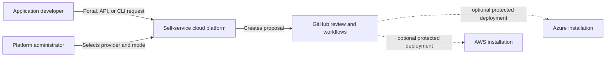

# Architecture

## System purpose

The platform converts a small developer environment request into a validated,
policy-compliant, deterministic infrastructure proposal. GitHub is the review
and audit boundary. Optional real deployment is separate from request handling
and remains protected by short-lived identity and human approval.

## Context



One installation selects AWS or Azure, never both. The inactive provider is
not configured and receives no request or credential.

## Core boundaries

```text
Interfaces                 Domain                   Delivery
---------------------      --------------------     ----------------------
React portal ---------\    Installation profile     GitHub proposal
FastAPI --------------+--> Environment request ---> validation and policy
CLI ------------------/    Provider adapter          protected deployment
                              |                         |
                              +--> AWS Terraform ------+
                              +--> Azure Terraform ----+
```

- Interfaces share one domain model and do not apply infrastructure.
- Common policy expresses outcomes; provider policy expresses native controls.
- AWS and Azure Terraform implementations remain separate.
- Real values and credentials remain outside the public repository.
- Simulation is the default implementation and test boundary.

## Quality attributes

- **Safety:** no request interface can bypass GitHub review or apply directly.
- **Auditability:** normalized request hashes connect proposals, plans,
  approvals, deployment, and rollback.
- **Portability:** common behavior is provider-independent without hiding
  provider-native security differences.
- **Usability:** policy failures are expressed in language understandable to a
  developer rather than only Terraform or Rego output.
- **Reproducibility:** one normalized request produces deterministic generated
  inputs and equivalent API, CLI, and portal results.

Detailed component, sequence, provider topology, identity, state, logging,
threat, and incident diagrams will be added alongside their implementations.
