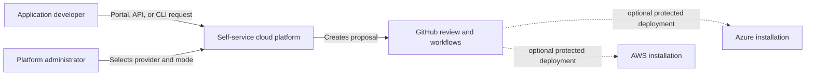

# Architecture

## System purpose

The platform converts a small developer environment request into a validated,
policy-compliant, deterministic infrastructure proposal. GitHub is the review
and audit boundary. Optional real deployment is separate from request handling
and remains protected by short-lived identity and human approval.

## Context



One installation selects AWS or Azure, never both. The inactive provider is
not configured and receives no request or credential.

## Core boundaries

```text
Interfaces                 Domain                   Delivery
---------------------      --------------------     ----------------------
React portal ---------\    Installation profile     GitHub proposal
FastAPI --------------+--> Environment request ---> validation and policy
CLI ------------------/    Provider adapter          protected deployment
                              |                         |
                              +--> AWS Terraform ------+
                              +--> Azure Terraform ----+
```

- Interfaces share one domain model and do not apply infrastructure.
- Common policy expresses outcomes; provider policy expresses native controls.
- AWS and Azure Terraform implementations remain separate.
- Real values and credentials remain outside the public repository.
- Simulation is the default implementation and test boundary.

## Quality attributes

- **Safety:** no request interface can bypass GitHub review or apply directly.
- **Auditability:** normalized request hashes connect proposals, plans,
  approvals, deployment, and rollback.
- **Portability:** common behavior is provider-independent without hiding
  provider-native security differences.
- **Usability:** policy failures are expressed in language understandable to a
  developer rather than only Terraform or Rego output.
- **Reproducibility:** one normalized request produces deterministic generated
  inputs and equivalent API, CLI, and portal results.

Detailed component, sequence, provider topology, identity, state, logging,
threat, and incident diagrams will be added alongside their implementations.

## Shared interface flow

The [interface flow](diagrams/rendered/interface-flow.svg) shows the implemented
Milestone 5 boundary. The React portal calls FastAPI through its generated
OpenAPI client, while the Typer CLI calls the same application service
directly. Both paths reach the same normalization, policy, provider routing,
and deterministic result contracts. Neither path can apply infrastructure.

## First rendered views

The [system context diagram](diagrams/rendered/system-context.svg) shows the
people, platform boundary, GitHub review boundary, and the two possible cloud
destinations. AWS and Azure are alternative installation targets; a single
installation never sends a request to both providers.

The [provider-selection state diagram](diagrams/rendered/provider-selection.svg)
shows the installation lifecycle. The administrator selects a provider and
mode before activation. Once activated, the provider is locked; a request for
the other provider must use a separate installation and state boundary.

These diagrams are rendered from the
[`docs/diagrams/src/`](diagrams/src/system-context.mmd) directory with a
pinned Mermaid CLI. The rendered SVGs are committed so documentation readers
can view them without a local toolchain. Each committed SVG contains a
content-only SHA-256 freshness fingerprint covering its source, Mermaid
configuration, Puppeteer configuration, and package lock. CI renders every
source into a clean temporary directory on Ubuntu and checks those fingerprints
and one-to-one source/output names. The check does not require byte-identical
SVGs across operating systems, because browser rendering bytes can vary by
platform.
