# Protected deployment workflows

The repository implements manual workflow definitions for proposal input
publication, plan, apply, drift, rollback, destroy plan, and destroy apply. They
are the only real-capable boundary and have not run against a provider.

## Fail-closed gates

Real lifecycle jobs require all of the following:

- `REAL_DEPLOYMENT_ENABLED == 'true'` (currently absent or false);
- private repository and default-branch manual dispatch;
- exact 40-character commit, provider (`aws|azure`), real mode
  (`sandbox|enterprise`), request/proposal IDs, and proposal/tfvars hashes;
- independent reviewer input distinct from requester and workflow actor;
- operator-configured protected GitHub Environment approval;
- provider/mode/operation concurrency with cancellation disabled;
- environment-bound short-lived OIDC and protected backend/runtime variables;
  and
- typed `APPLY`, `ROLLBACK`, or two-part `DESTROY` confirmation where required.

Proposal validation publishes exact `proposal.json`/Terraform variables for one
day. Plan downloads those inputs, authenticates, creates a saved plan, hashes
the plan and bindings, and uploads them for one day. Apply and rollback download
the exact workflow-run artifact and verify all supplied hashes before applying
the saved plan. Destroy uses separate plan and apply workflows, a separate
identity/Environment, two confirmations, and a shared destroy concurrency group.

Saved plans can contain sensitive values. Use a private repository for any
real-capable installation; the included jobs enforce this. Never publish plan
artifacts or extend retention without security review.

## Operator responsibilities

The repository does not create protected Environments, required reviewers,
self-review prevention, deployment branch restrictions, repository variables,
OIDC trust, accounts/subscriptions, or state. One-time bootstrap and all runtime
configuration require separate operator approval. If any binding or variable is
missing, the workflow must remain skipped or fail before mutation.
