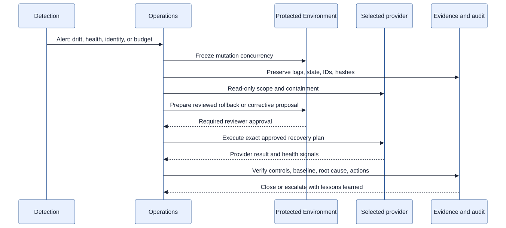

# Incident response

The shared response loop is detect, contain, preserve evidence, recover,
verify, and learn. Freeze proposal/apply/destroy concurrency at the affected
installation and keep a separate incident record. Do not rotate or delete
evidence before preserving it.

## AWS scenario: public EKS endpoint detected

**Detect:** Config/Security Hub or drift reports that the EKS endpoint is public.

**Contain:** pause the GitHub Environment, revoke/disable the affected OIDC
role if compromise is suspected, restrict network access, and notify security.
Preserve CloudTrail, Config, EKS audit/control-plane logs, workflow run IDs,
state version, and proposal/plan hashes.

**Recover:** use the AWS runbook to restore private endpoint policy and network
controls through an approved rollback or corrective proposal. Verify IAM/IRSA,
VPC endpoints, KMS, CloudTrail, GuardDuty, and Security Hub continuity. Do not
assume recreating the cluster is safe without a data and identity review.

**Close:** confirm no unauthorized access, rotate affected trust if required,
record root cause, and add a policy/drift regression test.

## Azure scenario: AKS identity or Key Vault access failure

**Detect:** Azure Monitor/Activity Log, Defender, drift, or workload health
shows AKS Workload Identity or Key Vault private access failing.

**Contain:** pause the protected Environment and affected federated identity,
preserve Activity Log, AKS diagnostics, Entra sign-in/audit events, Key Vault
logs, workflow IDs, state version, and proposal/plan hashes. Keep the cluster
private and do not make ad hoc public-endpoint changes.

**Recover:** verify the exact Entra federated credential subject, role scope,
private endpoint/private DNS, Key Vault soft-delete/purge-protection state, and
AKS identity configuration. Apply a reviewed rollback or corrective proposal,
then test workload token exchange, secret retrieval, logging, and policy.

**Close:** revoke unnecessary assignments, rotate any exposed secret, record
propagation timing and root cause, and add a federation/private-endpoint test.

Both scenarios require operator access and are not live exercises in this release.
