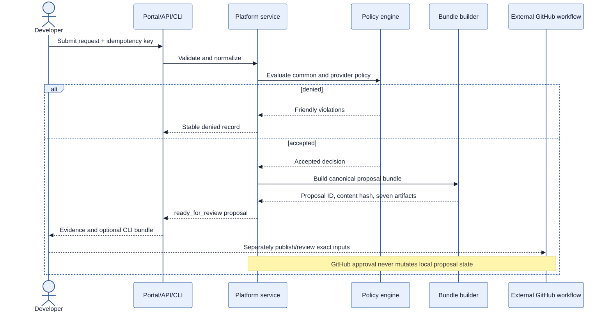

# Deterministic proposal lifecycle

The Milestone 6 proposal contract is implemented as a pure, credential-free
transformation of an accepted normalized request, its simulation result, and
the active installation. FastAPI, CLI, and portal expose the same immutable
proposal. The API stores proposals only in process memory.

## Lifecycle



```text
request accepted -> proposal ready_for_review
                           |
                           +-> external GitHub review/workflows (not proposal state)
```

`ready_for_review` is the only proposal state the local service claims. GitHub
review, protected approval, plan, apply, drift, rollback, and destroy are
external workflow events and never cause the in-memory proposal to pretend it
advanced. Restarting the API clears request, idempotency, and proposal records.

## Bundle contract

An accepted proposal is a content-addressed bundle with these stable parts:

| Part | Contents | Determinism rule |
| --- | --- | --- |
| Request | normalized JSON and YAML | canonical field order, normalized strings and money |
| Identity | request ID, fingerprint, proposal ID, schema, installation/provider/mode | derived from canonical request and installation |
| Policy | Markdown decision summary | stable, friendly result |
| Simulation | provider resource manifest | sorted provider-native descriptions |
| Terraform input | AWS or Azure `.auto.tfvars.json` | request-derived allowlisted keys only |
| Proposal summary | review-only Markdown | no credentials, timestamps, or cloud identifiers |

The fingerprint is a specification identity, not a claim that a cloud plan is
unchanged. A protected plan is separately bound to its exact source commit,
provider/mode/backend selection, proposal/tfvars hashes, workflow run, and
saved-plan SHA-256 hash.

The proposal contains seven sorted artifacts:

```text
environments/policies/<request-id>.md
environments/proposals/<proposal-id>.md
environments/proposals/<proposal-id>.json
environments/requests/<request-id>.json
environments/requests/<request-id>.yaml
environments/terraform/<provider>/<request-id>.json
infrastructure/terraform/<provider>/<request-id>.auto.tfvars.json
```

CLI materialization also writes `.platform-proposal.json`, an allowlist marker
used to make `--force` replacement fail closed. The materializer stages and
atomically replaces only a marked bundle with exactly the declared files; it
rejects special roots, symlink traversal, unmarked content, and path escapes.

## Gates

The implemented workflow definitions have independent gates:

1. schema, normalization, common policy, and provider policy;
2. generated-bundle reproducibility and content hash;
3. Terraform/policy/workflow/container/Helm proposal checks;
4. exact commit/proposal input publication with one-day retention;
5. provider/mode/request/proposal/commit and input-hash verification;
6. Terraform plan from the selected provider root;
7. protected Environment approval and short-lived OIDC;
8. typed confirmation and exact saved-plan hash for mutation; and
9. separate drift, rollback, and two-stage destroy paths.

The protected Environment must have required reviewers, prevent self-review by
the workflow initiator, and restrict deployment branches/tags. Included
workflows serialize by provider/mode/operation; operators must also prevent
unsafe cross-operation overlap for one installation/state. Jobs fail closed if operator-configured
protections are missing. Repository code does not configure these GitHub
settings or variables automatically. `REAL_DEPLOYMENT_ENABLED` remains absent
or false, so no real-capable job is enabled.

No portal, API, or CLI command is a direct Terraform lifecycle path. The
protected manual workflows are the only implemented real-capable boundary.
Saved plans can contain sensitive values; the workflows restrict real jobs to
private repositories and retain plan artifacts for one day.

## Proposal and status references

The [API reference](reference/api.md), [CLI reference](reference/cli.md), and
[portal reference](reference/portal.md) describe the implemented local proposal
surfaces. Creating a proposal creates review evidence, not a GitHub pull request
or a cloud change.
