# AWS sandbox and enterprise design

The AWS adapter is a deterministic simulation. The AWS root/modules, bootstrap,
policy fixtures, and protected workflow path are implemented and locally
validated without contacting AWS.

## Sandbox

One non-production AWS account contains a constrained VPC, private EKS API and
nodes, controlled egress, KMS encryption, CloudWatch/CloudTrail diagnostics,
GuardDuty/Security Hub, Secrets Manager, and an AWS Budget. The account has one
approved region, small cluster tiers, mandatory owner/cost tags, and automatic
expiry for development/test requests. Production is rejected by policy.

The sandbox's blast radius is intentionally bounded: no cross-account trust,
no public Kubernetes endpoint, no unmanaged long-lived deployment key, and a
separate destroy approval path.

## Enterprise

The reference landing zone separates management, security, log archive,
network, shared services, development, test, and production accounts. A
network account owns shared connectivity and controlled egress; a log archive
receives immutable audit copies; shared services hosts the platform control
plane. Environment accounts receive only the roles and network paths needed by
their workload.

Production has stricter approval, larger availability-zone redundancy, and
independent budgets. It never shares Terraform state with sandbox or another
provider installation.

## Identity and deployment path

GitHub Actions exchanges its job OIDC token for a narrowly scoped AWS IAM role.
The role is restricted by repository, workflow, ref/environment, audience, and
permissions boundary. Separate plan, apply, and destroy roles are implemented;
apply is available only to a protected Environment after exact-commit and saved-plan
checks. Human SSO is used for bootstrap and emergency break-glass, not stored
in CI.

The root implements one environment stack. The full multi-account enterprise
landing zone remains operator-owned architecture and is not created by this
repository.

See [authentication and OIDC](../authentication-oidc.md), [Terraform modules](../terraform-modules.md),
and [protected deployment](../operations/deployment.md).
