# Azure sandbox and enterprise design

The Azure adapter is a deterministic simulation. The Azure root/modules,
bootstrap, policy fixtures, and protected workflow path are implemented and
locally validated without contacting Azure.

## Sandbox

One non-production subscription contains a private AKS cluster, Azure CNI
network, controlled NAT egress, Key Vault, private endpoints, Azure Monitor
and Log Analytics diagnostics, Activity Log, Azure Policy, Defender for Cloud,
and a Cost Management budget. One approved region, small cluster tiers,
mandatory tags, and non-production expiry are required. Production is rejected.

## Enterprise

The reference tenant uses management groups and separate management,
connectivity, identity, shared-services, development, test, and production
subscriptions. Hub-spoke networking, centralized egress, private DNS, central
diagnostics, and delegated RBAC make the trust boundaries visible. Shared
services hosts the platform control plane; workloads stay in their environment
subscriptions.

## Identity and deployment path

GitHub Actions uses Entra workload identity federation with repository,
workflow, ref/environment, audience, and subject conditions. Separate plan,
apply, and destroy federated identities limit privilege. Apply is available
only after protected Environment approval, exact-commit verification, saved-plan hash
verification, and preflight budget/policy checks.

Human Entra administration is used for bootstrap and break-glass. No client
secret is stored in GitHub or the public repository.

The root implements one environment stack. The full management-group and
multi-subscription enterprise landing zone remains operator-owned architecture
and is not created by this repository.
