# Security and threat model

The principal security objective is to make the approved path easier than an
ad hoc cloud change while preventing a request interface from becoming a
credentialed control plane.

## Trust zones

1. **User zone:** developer and administrator browsers/terminals.
2. **Application zone:** portal, API, domain service, and policy engine.
3. **Review zone:** GitHub repository, checks, pull requests, and protected
   Environments.
4. **Evidence zone:** proposal metadata, logs, metrics, and protected plan
   artifacts.
5. **Provider zone:** one selected AWS account or Azure subscription boundary.

Local validation crosses no provider boundary. An enabled real workflow can
cross it only through a short-lived OIDC identity after review and approval.

## Threat paths and controls

| Threat | Control | Residual risk |
| --- | --- | --- |
| request injects public network or oversized cluster | common/provider policy before proposal | policy regression; test and review policy bundles |
| caller swaps provider after setup | immutable installation and separate state | administrator must create a new installation |
| malicious pull request changes workflow | branch protection, pinned actions, CODEOWNERS, protected environments with required reviewers, self-review prevention, deployment branch restrictions, and concurrency | GitHub governance must be maintained |
| stolen CI token | OIDC short TTL, audience/subject/ref conditions, least privilege | provider trust misconfiguration |
| plan/apply mismatch | exact commit and saved-plan hash gates | backend/state changes need explicit preflight |
| secret or state leakage | secret stores, redaction, no public artifacts, encrypted backend | operator logging mistakes |
| drift hides a security change | manual read-only drift workflow and reconciliation review | no schedule/alert integration in this RC |
| destroy harms production | mode policy, separate workflow, typed confirmation, approval | human error; use scoped state and backups |

Threat modelling does not replace provider security review, penetration testing,
or organizational controls. This RC documents the design and local evidence;
it does not claim a live security assessment.

## Protected deployment acceptance

The operator must verify, outside repository code, that the target GitHub
Environment has required reviewers, prevents the initiator from approving their
own deployment, and restricts deployment branches/tags. Included workflows use
provider/mode/operation concurrency; operators must prevent unsafe cross-
operation overlap for each installation/state boundary. The workflow must fail closed when
those protections are absent. OIDC trust must use an environment-bound subject:
AWS with audience `sts.amazonaws.com` and exact repository/environment subject;
Azure with the exact GitHub issuer and exact repository/environment federated
credential subject. These controls are configuration prerequisites, not
automatically provisioned by this repository.
