# State model

The implementation separates local application state, review artifacts, saved
plans, and provider state. Only the first exists during the local portfolio demo.

| State | Implemented location | Lifetime/sensitivity |
| --- | --- | --- |
| installation, request, proposal, idempotency | FastAPI process memory | cleared on restart; no durable recovery |
| CLI proposal bundle | operator-selected local directory | sanitized review evidence plus marker |
| proposal input artifact | GitHub Actions artifact when manually published | one-day retention; sanitized exact inputs |
| saved plan/destroy plan | GitHub Actions artifact when real workflow runs | sensitive; exact hashes; one-day retention |
| AWS Terraform state | bootstrap-created S3 backend | KMS encrypted, versioned, public blocked, native lockfile |
| Azure Terraform state | bootstrap-created Blob backend | HTTPS/private by default, encrypted, versioned, deletion retention, lease locking |

The local `DeploymentProposal` is immutable and has only
`ready_for_review`. Protected approval and workflow outcomes remain external;
they do not mutate or advance proposal state. API metrics count in-memory
proposals, not deployments.

Saved Terraform plans can contain provider-derived sensitive values. The
included workflows restrict real-capable jobs to private repositories, bind
proposal/tfvars/plan SHA-256 values and exact workflow run IDs, and retain
proposal/plan artifacts for one day. Artifacts must not be copied to public
issues, pull requests, release assets, or Pages.

No provider state backend or protected lifecycle artifact was created by this
release.
